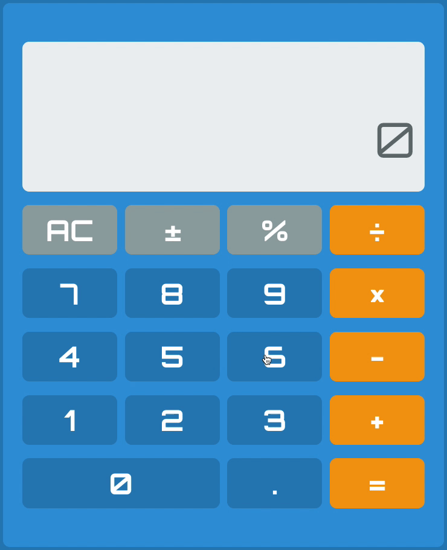
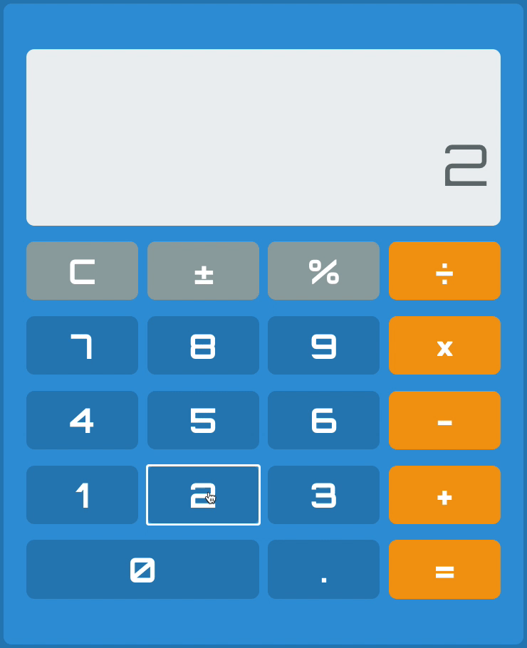
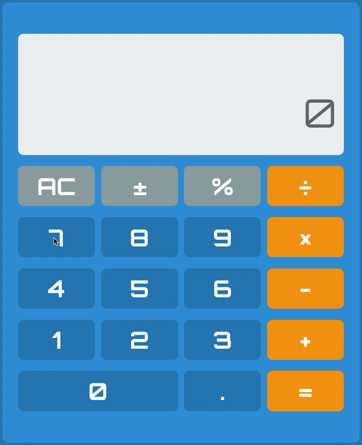

# Calculator

> A responsive calculator built with React.js

---

## Table of Contents
* [Technologies](#technologies)
* [Features](#features)
* [Demonstrations](#demonstrations)
* [Inspiration](#inspiration)
* [Contact](#contact)
* [License](#license)

## Technologies
#### Built with:

#### Deployed via:

## Features
### Completed:
- [X] Update and display term value(s) and current equation per user input
- [X] Perform basic mathematical operations such as addition *[+]*, subtraction *[-]*, multiplication *[×]*, and division *[÷]*
- [X] Handle operations using both integers and/or floating point numbers
- [X] Display the calculated value from the current equation on calculation input *[=]*
- [X] Allow user to clear current input *[C]* or clear current input and equation *[AC]*; Available option depends on current state
- [X] Functioning sign key *[±]* can be used to change the sign of the current input from positive to negative or vice versa
- [X] Functioning percent key *[%]* can be used to perfrom percentage calculations ***(Note: This key functions as explained in [this Microsoft article by Raymond Chen circa 2008](https://devblogs.microsoft.com/oldnewthing/20080110-00/?p=23853))***
- [X] Implement history component, that can be toggled, to display previous calculations and allow user to clear history
- [X] Save and retrieve calculator history in localStorage

### To-Do:
- [ ] User can toggle between themes such as light and dark mode

## Demonstrations

Addition

Subtraction

Multiplication

Division

Sign Change

Percent

## Inspirations
This project was initially built for freeCodeCamp's [Front End Libraries Certification](https://www.freecodecamp.org/learn/front-end-libraries/front-end-libraries-projects/build-a-javascript-calculator)

## Contact

<table>
	<tr>
		<td rowspan="2" style="padding: 0;">
			
		</td>
		<td style="padding: 0 10px;">
			<h3 style="margin: 0;">Christopher Stanley</h3>
			<small>
				<a href="https://cbstanley.dev">&#x1F310</a>
				<em> cbstanley.dev</em>
			</small>
			 
			<small>
				<a href="mailto:chris@cbstanley.dev">&#x2709</a>
				<em> chris@cbstanley.dev</em>
			</small>
			

				
				
				
			

		</td>
	</tr>
</table>

## License
This project is licensed under the MIT License *(see the [LICENSE](LICENSE) file for details)*